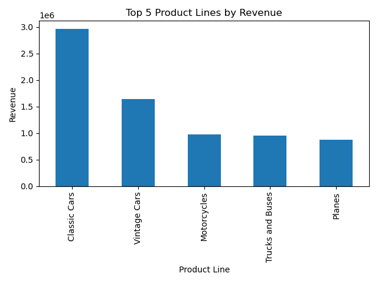
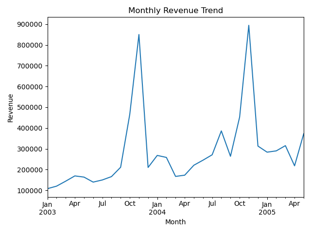
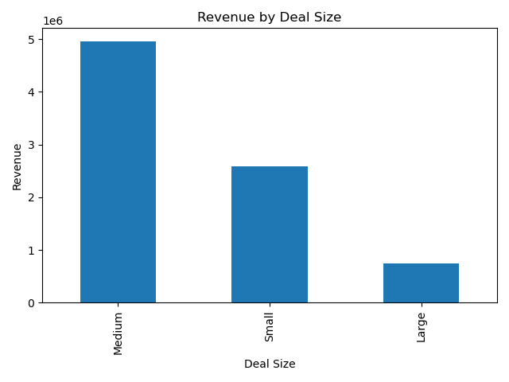

# sales-etl-python
ETL and Analysis of Sample Sales Data using Python

# Sales ETL & Analysis with Python

This project simulates a basic end-to-end ETL pipeline using real-world-style sales data. Built using Python, the notebook extracts raw CSV data, transforms it for analysis, and generates simple business insights.

---

## Tools & Libraries Used
- Python 3
- Pandas
- Matplotlib

---

## Workflow Overview

### 1. Extract
- Loaded raw CSV sales data from Kaggle

### 2. Transform
- Converted order dates to datetime format
- Removed missing or invalid values
- Calculated `TotalRevenue` from quantity × price

### 3.  Visualize
- Top product lines by total revenue chart
- Monthly revenue trend over time chart
- Revenue by deal size chart

### 4. Load
- Saved cleaned data to CSV

---

## 📊 Example Charts

### Top 5 Product Lines by Revenue

### Monthly Revenue Trend

### Revenue by Deal Size

---

## 📁 Included Files
- `Sales_ETL_Project.ipynb` – Full Jupyter Notebook
- `cleaned_sales_data.csv` – Final cleaned dataset
- `.png` charts – Visual summaries of results

---

## 📂 Data Source
[Sample Sales Data – Kaggle Dataset](https://www.kaggle.com/datasets/kyanyoga/sample-sales-data)

---

## ✅ Outcome
This project demonstrates a complete data pipeline using Python — from raw data ingestion to actionable business insights. It mimics how analysts and data engineers clean, explore, and present findings in a professional setting.
